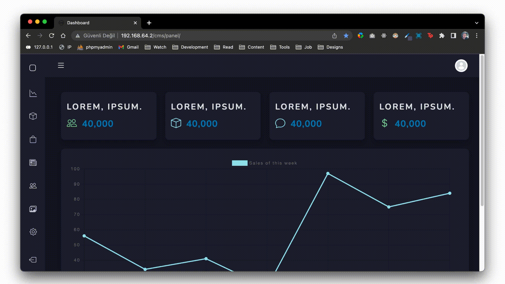

# CodeIgniter 3 & Bootstrap 5 Responsive CMS 
## Feel Free To Use & Follow For More Projects :)



## What is this CMS?
This CMS is a simple CodeIgniter 3 based content managemnt system.

## Who is it for?
* You are a php developer who use CodeIgniter framework.
* You are a web developer who wants to learn and create somethings with CodeIgniter framework.
* You are tired of building the same things for every project.
* You want a simple and easy to understand CMS.
* You are in tight deadline, at least you need to provide a prototype to your client.

## General info

This is a responsive CodeIgniter 3 & Bootstrap 5 Responsive CMS with features like;

* Dark mode
* Setting column visibility in data tables
* Dynamic search in tables
* Export data tables as CSV, Excel, PDF format
* One click print data tables
* One click copy all data table records
* Dynamic sorting of rows in data tables
* Drag & Drop Multiple image upload
* Ability assign a user role to each user
* Ability to control viewing, adding, updating, deleting permissions according to user roles

## Technologies

Project is created with;

* CodeIgniter 3.1.13
* Bootstrap 5.1.3
* Bootstrap Icons 1.8.0
* Chart.js 3.7.0
* Jquery 3.5.1
* Jquery UI 1.13.1
* Datatables 2.2.2
* Dropzone JS

## License
GPL & MIT License: You can use this CMS for whatever purpose, modify the code, and gain money by using it.

## Contributing
I made this CMS, but together we can make it better. There are many way we can do to make this CMS better:

* Make a suggestion
* Bug report
* Code contribution
* Improve user guide
* Translation

## Cloning the Project

```bash
git clone https://github.com/ahmetdogukankonuk/codeigniter-3-cms.git